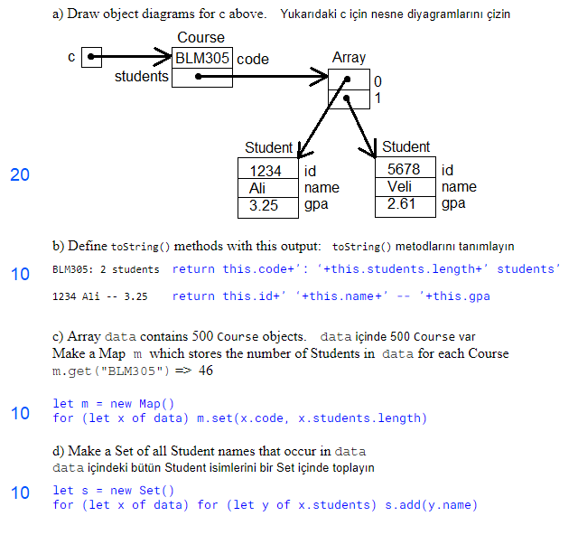
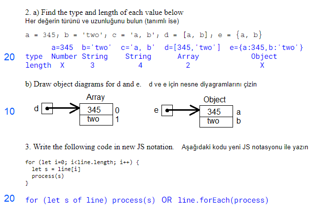

## Quiz#1 -- 2021

1. Consider the classes defined below 
````
class Student {
    constructor(id, name, gpa) {
        this.id = id; this.name = name; this.gpa = gpa
    }
    toString() { return ??? }
}
class Course {
    constructor(code) {
        this.code = code; this.students = []
    }
    addStudent(s) { this.students.push(s) }
    toString() { return ??? }
}
 
c = new Course('BLM305')
c.addStudent(new Student(1234, "Ali", 3.25))
c.addStudent(new Student(5678, "Veli", 2.61))
````




<script src="/2021/navbar.js"></script>
<style>
  body { 
    max-width: 640px; 
  }
  #navbar {
    margin-left: 0;
  }
</style>
