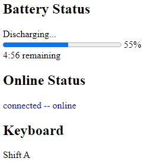

## Second Month

### Nov 23, 25: No class, no exam

### Nov 18: CW#10 -- [Event listeners](CW6.html)

Copy and modify your web page for CW6

Listen to the following events:

* b.onlevelchange, b.onchargingchange where b is BatteryManager
* onoffline, ononline, onkeydown, onkeyup (using window object)

Here is the desired output: 

Add your work to your home page and include a screenshot in LMS

### Nov 16: CW#9 -- [Improve your private repo](CW9.html)

**HW2: improve**

* Include your name and avatar
* All links must be to html pages
* No external libraries or frameworks
* No error on console (css, font, manifest, etc)
* Show properly on narrow screen (400px)
* HW1: improve or redo

**HW1: improve**

Make a copy of an existing math table. Include your code and an image of the original table.

* screenshot of improved HW1 page
* link to your main page (same as HW2)

### Nov 11: Quiz 2

### Nov 9: [Document Object Model](Page_by_JS.html)
* Evaluation of HW2 (no class work)

### Nov 4: CW#8 -- [SubtleCrypto: SHA](Crypto.html)

* Make a copy of displayBlob.html in CW7 with name subtleCrypto.html
* Remove all code related to displaying file contents
* Add these functions (not methods) 
  shaFromBuffer(b)  //ArrayBuffer  
  shaFromFile(f)  //File or Blob  
  shaFromURL(u)  //URL or string
* Calculate SHA-1 code of two large files (both local and remote) and verify using sha1sum or similar utility
* Your screenshot must show the code, the output. and the console  
(include some output that shows your error handling)

### Nov 2: CW#7 -- [Reading Local Files](displayBlob.html)

Copy this file to your repo: 
https://blm305.github.io/2021/work/displayBlob

Modify the code so that it displays remote and local files. 
Text, image, and error should be displayed correctly.

Include a screenshot that shows the page and the console. 
Your modified code must be readable.

