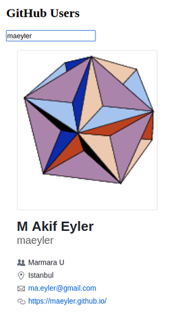

## Last Month

### Dec 30: CW#15 -- [Student database](Students.html)

Put a copy of this file to your repo: 

* Define a class to keep Course data similar to Student
* Define a function readCourses() to read the text file into crsMap (id => Course object)
* When a course id is entered, display the data related to that course
* Define function findBest() to find the best gpa in stdMap

Take a partial screen shot of your page with some real output.

### Dec 23: CW#14 -- [Image Inspector](ImageInspector.html)

Reponuza kopyalayın ve bu yazılıma en az bir metot ekleyin: flipHorizontal()

Verilen resmin ayna görüntüsünü yapsın. İki kere üst üste çağırınca orijinal resim çıkmalı. LMS raporunda şunlar olmalı:

* çalıştığını gösteren ekran görüntüsü
* sadece flipHorizontal() kodu

### Dec 16: CW#13 -- [Open Maps API](Open_Maps.html)

Hava Durumu uygulamasına bölgenin haritasını ekleyin
(Yeni bir dosya açın, önceki ödevi bozmayın)

* Ekranda hiçbir fazlalık olmasın (kod, referans, vb)
* Başlangıçta bulunduğunuz yeri zoom=10 ile gösterin
* Verilen Enlem/Boylam noktasını zoom değiştirmeden merkeze alın
* Haritada tıklanan noktayı merkeze alırken hava durumunu gösterin 
* Bonus: Ülkenin kısaltmasından adını bulun

Bu ödevde ekran resmi ve rapor yok. Yaptığınız sayfada sadece hava durumu ve harita olsun. Kod üstünde yaptığınız değişiklikleri LMS'e pdf olarak yükleyin.

### Dec 09: CW#12 -- [Open Weather API](Weather.html)

Kendi reponuza kopyalayın, ana sayfanıza ekleyin. Hava durumunu SVG ya da canvas elemanı içinde gösterin. Uygulamayı çalıştırmak için KEY gerekecek, halen alamadıysanız mail içinde verilen anahtarı deneyin.

Yaptığınız işi bir PDF raporunda gösterin/anlatın -- kod ekran resminde olacak

### Dec 02: CW#11 -- [GitHub users API](GitHub_Users.html)

Kendi reponuza kopyalayın ve değiştirin. Sayfadaki fazlalıkları atın, kullanıcı adınızı girince aşağıdaki bilgiler çıkmalı:

Ödevi reponuza koyun ve ana sayfaya ekleyin -- PDF içinde ekran resmi ve kod görünmeli.

