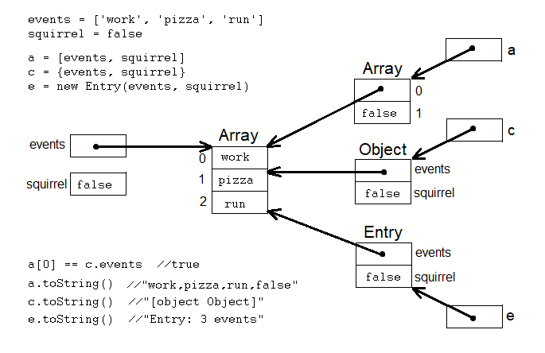

## Object Diagram

Make several variables and objects:
```
events = ['work', 'pizza', 'run']
squirrel = false
a = [events, squirrel]
c = {events, squirrel}
e = new Entry(events, squirrel)
```


```
a[0] == c.events  //true -- same object
a.toString()  //"work,pizza,run,false"
c.toString()  //"[object Object]"
e.toString()  //"Entry: 3 events"
```

<script src="/2021/navbar.js"></script>
<style>
  body { 
    max-width: 600px; 
  }
  #navbar {
    margin-left: 0;
  }
</style>
